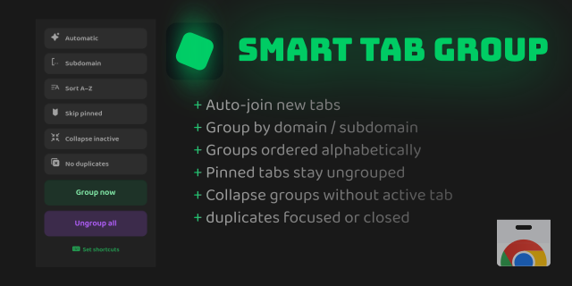

  
  <h3>Smart Tab Groups</h3>
  
Tab grouping by domain or subdomain

  
  

  
  

---

## Supported browsers

| Browser | Version | Notes |
|---------|---------|------|
| Chrome, Edge, Brave, Opera (Chromium-based) | current | Full support. |
| Firefox | 138+ | Desktop only; tab groups API required. |
| Safari | — | Not supported. |
| Firefox &lt; 138, Firefox Android | — | Not supported. |

---

Grouping by domain or subdomain; new tabs auto-join (when Automatic is on).

- **Domain/Subdomain** (group by domain or subdomain)
- **Sort A-Z** (sort tabs alphabetically)
- **Skip pinned** (exclude from groups)
- **Collapse inactive** (collapse groups without active tab)
- **No duplicates** (remove duplicate tabs)

> [!TIP]
> **Manual groups** you create in the browser are left **untouched**;
> only groups created by the extension are managed.

---

## Install

- **Chrome / Chromium-based**: `chrome://extensions` → **Developer mode** → **Load unpacked** → select this directory.
- **Firefox** (dev, unpacked): Open `about:debugging` → **This Firefox** → **Load Temporary Add-on**. In the file dialog, set the type to **All files** (the default “addons” filter expects an XPI), then pick **`manifest.json`** from this directory. The add-on loads until restart; use **Reload** on that page to apply changes.
- **Firefox** (from file): Pack an XPI: from this directory run `zip -r ../smart-tab-groups.xpi . -x "*.git*" -x ".dev/*" -x ".vite/*" -x "node_modules/*" -x "*.xpi"`, then in Firefox open `about:addons` → gear → **Install Add-on From File** → select the `.xpi`. For a signed/public install, use [AMO](https://extensionworkshop.com/documentation/publish/submitting-an-add-on/).

## Dev / Debug UI

Run `npx vite` to serve the UI for development and debugging (hot reload).

## Popup

- **Group now** — (re)group all tabs in the current window
- **Ungroup all** — remove grouping in the current window

### Options

| Option | Default | Description |
|--------|---------|-------------|
| Automatic | on | When on: new/updated tabs are grouped, install/startup runs Group now, inactive groups collapse. When off: use **Group now** (button or shortcut) to group manually. |
| Group by subdomain | off | Use full subdomain (e.g. `mail.google.com`) as group key instead of base domain. |
| Sort groups alphabetically | off | Order groups A–Z. |
| Skip pinned | off | Do not put pinned tabs into groups. |
| Collapse inactive groups | off | Collapse groups that don’t contain the active tab. |
| Avoid duplicates | off | New tab with same URL as existing tab in window → focus existing, close new. **Group now** also removes duplicate tabs (keeps one per URL). |

## Shortcuts

- **Group now**: `Ctrl+Shift+G` (Windows/Linux) / `Cmd+Shift+G` (Mac)
- **Ungroup all**: `Ctrl+Shift+U` (Windows/Linux) / `Cmd+Shift+U` (Mac)

Change shortcuts: **Chrome** → `chrome://extensions` → shortcut icon next to the extension. **Firefox** → `about:addons` → cog (Tools for all add-ons) → **Manage Extension Shortcuts**.

## Behavior

When **Automatic** is on (default):

- On install/startup/enable: runs **Group now** once.
- New or updated tab (http(s) URL): assigned to the matching domain group or creates a new group.
- With **Avoid duplicates**: opening/navigating to a URL that already exists in the window focuses that tab and closes the duplicate.

When **Automatic** is off, grouping runs only when you use **Group now** (popup or shortcut).

## License

[MIT](LICENSE)
